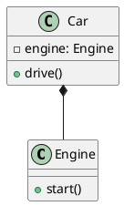

当然可以，以下是**梳理代码并绘制 UML 图的完整指导建议**，适用于 C++、Java、Python 等主流语言开发者，特别适合你现在希望理解工程结构的场景：

---

## 🎯 一、目标明确：为什么要画 UML 图？

* **理清类与模块之间的关系**：谁依赖谁？谁调用谁？
* **可视化设计/架构**：方便向他人讲解，也方便自己做系统性重构。
* **发现设计问题**：如强耦合、循环依赖、接口泄露等。

---

## 🪜 二、推荐的步骤（从源代码到 UML 图）

### 步骤 1️⃣：明确关注范围（Scope）

* 是分析一个类？一个模块？整个系统？
* 关注：

  * 类之间的继承关系？
  * 调用关系？
  * 依赖接口与实现解耦？

✅ 建议：**聚焦主要业务模块或核心组件，不必一次性全画全系统。**

---

### 步骤 2️⃣：初步阅读代码，记录以下关键结构

| 结构      | 说明                          |
| ------- | --------------------------- |
| 类 / 接口名 | 记录类名、接口名、模块名                |
| 成员变量    | 特别是包含其他类的成员（聚合/组合关系）        |
| 继承关系    | 父类/子类                       |
| 函数签名    | 包括参数和返回值，特别是虚函数、override的函数 |
| 函数调用链   | 谁调用谁？谁依赖谁？                  |
| 包或命名空间  | 辅助理解模块边界                    |

---

### 步骤 3️⃣：根据代码关系选择合适的 UML 图类型

| 图类型     | 适用场景                                           | 关键要素            |
| ------- | ---------------------------------------------- | --------------- |
| **类图**  | 梳理类结构、接口、继承、聚合、依赖                              | 类、接口、继承、成员变量、方法 |
| **时序图** | 了解对象之间的调用顺序（如一个请求从 controller → service → dao） | 对象、消息（方法调用）、时间线 |
| **组件图** | 理解模块（组件）之间的依赖关系                                | 组件、接口、依赖        |
| **包图**  | 多命名空间/模块项目中可视化包的层次                             | 包、包依赖关系         |
| **用例图** | 面向用户视角理解需求和系统交互                                | 参与者、用例、关系       |

✅ 建议初学者**先从类图开始**，掌握结构关系，再逐步绘制其他图。

---

### 步骤 4️⃣：手动 or 自动？绘图工具选择建议

#### ✅ 手动绘图（更适合学习理解）

* **PlantUML（推荐）**：支持类图、时序图、组件图等

  * 示例语法（类图）：

    ```plantuml
    class Controller {
        +handleRequest()
    }
    class Service {
        +process()
    }
    Controller --> Service
    ```

* **Visual Paradigm / StarUML / Draw\.io**：可拖拽图形，适合初学者可视化操作

#### ⚙️ 自动生成工具（可辅助，但生成质量参差）

* **C++/Java**：

  * \[Doxygen + Graphviz]：适用于有注释的代码，生成类图
  * [SourceTrail](https://www.sourcetrail.com/)：交互式查看调用关系（推荐）
  * [ObjectAid UML Explorer](https://www.objectaid.com/)：Java 插件
  * \[IntelliJ IDEA / CLion UML 插件]：右键生成类图

---

## 🧠 三、绘图过程中常见关系与 PlantUML 语法速查

| 关系   | PlantUML 语法   | 示例                   |              |             |
| ---- | ------------- | -------------------- | ------------ | ----------- |
| 继承   | \`A <         | -- B\`               | \`Shape <    | -- Circle\` |
| 实现接口 | \`Interface < | .. Class\`           | \`Drawable < | .. Car\`    |
| 依赖   | `A ..> B`     | `Controller ..> DAO` |              |             |
| 聚合   | `A o-- B`     | `Team o-- Member`    |              |             |
| 组合   | `A *-- B`     | `House *-- Room`     |              |             |
| 关联   | `A --> B`     | `Student --> Course` |              |             |

---

## 🧪 四、实际操作案例（简化 C++ 项目）

### 代码结构：

```cpp
class Engine {
public:
    void start();
};

class Car {
private:
    Engine engine;
public:
    void drive();
};
```

### UML 类图（PlantUML 表达）：



---

## 📌 五、你的情况特别建议：

根据你说的「**现在需要梳理代码并编写 UML 图用于辅助理解**」：

✅ 具体建议：

1. **先选一两个类/模块开始梳理**，避免一上来信息量过大。
2. **PlantUML 是最推荐的入门工具**，语法简单、可嵌入 markdown 或 IDE。
3. **不建议依赖自动工具生成初版图**，容易干扰对架构本质的理解。
4. **记录模块依赖 + 类继承/组合关系最关键**，可帮助你快速发现设计瓶颈。
5. 如果你愿意，我可以：

   * 根据你的一段代码，**帮你手动画出 UML 图示例**；
   * 或者 **教你用 PlantUML 从 0 到 1 画出类图或时序图**。

---

需要我帮你从具体代码入手绘制 UML 吗？你可以贴出部分模块代码（C++/Python/Java等），我来示范如何梳理出类图或调用关系图。
