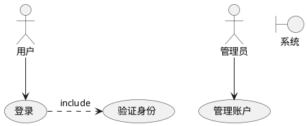
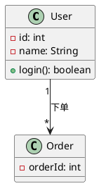
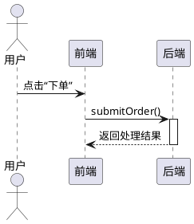
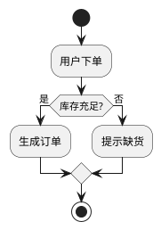
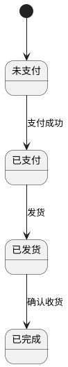
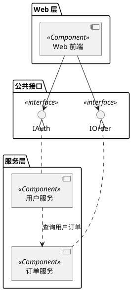
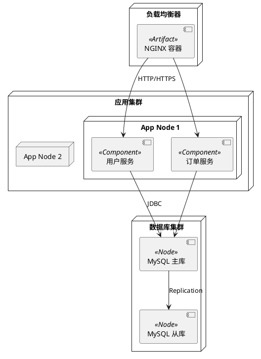

本文将为你全面介绍 UML（Unified Modeling Language，统一建模语言）的基本概念、常用图表、绘制规范与最佳实践，帮助你在软件设计与架构阶段高效地使用 UML，提升团队沟通与项目质量。

---

## 一、为什么要使用 UML

* **可视化设计**：UML 提供了一套标准化的符号与图表，让抽象的系统结构和行为得以直观呈现。
* **促进沟通**：团队成员（开发、测试、产品、架构）可以通过一致的图形语言进行讨论，减少歧义。
* **文档化与复用**：UML 图表是系统文档的重要组成，高质量的图表能够在项目后期或交接时发挥巨大价值。
* **支持多阶段开发**：从需求分析、系统设计到详细设计，UML 均有对应的图表类型支持不同层面的建模。

---

## 二、UML 图的分类

UML 图大体可分为两类：结构图（Structural Diagrams）与行为图（Behavioral Diagrams）。

| 分类  | 图表类型                                                                                                                                  | 说明       |
| --- | ------------------------------------------------------------------------------------------------------------------------------------- | -------- |
| 结构图 | 用例图（Use Case Diagram） 类图（Class Diagram） 对象图（Object Diagram） 组件图（Component Diagram） 部署图（Deployment Diagram）            | 描述系统静态结构 |
| 行为图 | 顺序图（Sequence Diagram） 通信图（Communication Diagram） 活动图（Activity Diagram） 状态图（State Machine Diagram） 时序图（Timing Diagram） | 描述系统动态行为 |

---

## 三、常用 UML 图及绘制要点

### 3.1 用例图（Use Case Diagram）

* **作用**：展示系统边界、参与者（Users/Actors）及其与系统功能（用例）的交互。
* **主要元素**：

  * 参与者（Actor）：用小人图标或矩形标注。
  * 用例（Use Case）：椭圆形。
  * 关系：关联（直线）、包含（«include»）、扩展（«extend»）。

> **绘制要点**：
>
> * 明确系统边界，避免把“外部”功能画进来；
> * 用例粒度适中，一个用例应体现一个完整的业务目标；
> * 用例之间的«include»与«extend»关系要谨慎使用。

---

### 3.2 类图（Class Diagram）

* **作用**：描述系统的静态结构，包括类、属性、方法及它们之间的关系。
* **主要元素**：

  * 类：三层盒子——类名／属性／方法；
  * 关系：关联（Association）、聚合（Aggregation）、组合（Composition）、继承（Generalization）、依赖（Dependency）。

> **绘制要点**：
>
> * 属性与方法的可见性统一使用“+”（public）、“-”（private）、“#”（protected）；
> * 聚合用空心菱形，组合用实心菱形；
> * 切忌让类图过于臃肿，可拆分为多个子域／子系统的局部类图。

---

### 3.3 顺序图（Sequence Diagram）

* **作用**：描述对象间随时间顺序发生的消息交换，适用于展现某一业务场景或方法调用流程。
* **主要元素**：

  * 参与者／对象：顶部列出；
  * 生命线（Lifeline）：虚线；
  * 消息：实线带箭头（同步调用）、虚线带箭头（异步调用/返回）。

> **绘制要点**：
>
> * 关注时间顺序，自顶向下；
> * 如果场景复杂，可分段拆分成多个子顺序图；
> * 避免在同一图中混合多条并发流程。

---

### 3.4 活动图（Activity Diagram）

* **作用**：描述业务流程或算法的控制流，类似流程图，但支持并发。
* **主要元素**：

  * 活动节点（Activity）：圆角矩形；
  * 控制流（Control Flow）：箭头；
  * 决策节点（Decision）：菱形；
  * 合并节点、分叉／汇合节点、开始／结束节点。

> **绘制要点**：
>
> * 使用分叉/汇合表示并行；
> * 决策节点应有至少两条分支；
> * 保持流程简洁，一张图不超过 10 个节点。

---

### 3.5 状态图（State Machine Diagram）

* **作用**：描述对象生命周期内不同状态及状态之间的转移。
* **主要元素**：

  * 状态（State）：圆角矩形；
  * 转移（Transition）：带事件/动作标签的箭头；
  * 初始状态（黑点）、终止状态（带圈点）。

> **绘制要点**：
>
> * 适合表现“状态驱动”系统；
> * 每个状态要清晰且不可过多；
> * 事件与动作要用“事件/动作”格式标注。

---

## 四、UML 绘制工具推荐

* **在线**：PlantUML、Draw\.io（diagrams.net）、Lucidchart
* **桌面**：StarUML、Visual Paradigm、Enterprise Architect

> **Tip**：使用 PlantUML 可以通过简单的文本脚本快速生成图表，非常适合版本控制和持续集成。

---

## 五、最佳实践与常见陷阱

1. **保持简洁**：一张图聚焦一个场景或子系统，避免“万能图”过于复杂。
2. **及时更新**：设计变更后要同步更新 UML，防止文档失真。
3. **图文并茂**：必要时配合文字说明，解释复杂流程或决策依据。
4. **团队约定**：统一绘图规范（字体、颜色、标注方式），提升可读性。
5. **避免过度设计**：在敏捷开发中，只绘制当前迭代所需的 UML，切忌“为了画图而画图”。

---

## 六、结语

UML 是一把强大的建模利器，合理使用能让系统设计更清晰、团队沟通更高效、文档更具可维护性。希望本文能帮助你快速上手各类 UML 图，并在实际项目中驾轻就熟。立即打开你喜欢的 UML 工具，开始动手绘制第一张用例图吧！

下面这篇博客将聚焦于 UML 中的组件图（Component Diagram）、部署图（Deployment Diagram）以及其他几种辅助开发与设计时常用的图表，帮助你在系统架构与部署方案设计阶段更高效、清晰地表达系统高层结构和运行环境。

---

## 一、为什么需要组件图和部署图

* **组件图**：展示系统中各个模块／服务（组件）之间的依赖关系、接口契约，以及如何协作完成业务功能。适合微服务化、插件化或大型单体系统的模块化设计。
* **部署图**：展示系统在物理或虚拟基础设施上的部署拓扑，包括服务器节点、容器、网络连接，以及各组件在节点上的分布情况。帮助 DevOps／运维团队规划集群、容器编排及网络策略。

这两种图配合使用，可以让架构师与运维、开发团队对“哪个模块跑在哪台机器／容器上，以及它们之间如何通信”一目了然，从而减少误会、加速落地。

---

## 二、组件图（Component Diagram）

### 2.1 主要元素

* **组件（Component）**：用带小折角的矩形表示，代表可独立部署或复用的软件模块／服务。
* **接口（Interface）**：以圆形符号（提供接口）或半圆形／球形（需要接口）标示，表示组件对外暴露或依赖的契约。
* **依赖（Dependency）**：虚线箭头，指向所依赖的组件或接口。
* **连接（Connector）**：实线，可用于表示物理或逻辑链接。

### 2.2 PlantUML 示例

### 2.3 绘制要点

1. **按关注点分包（Package）**：将组件按层次、功能或子系统归类，避免“组件云”难以阅读。
2. **清晰标注接口契约**：用接口符号区分「提供」与「依赖」，减少箭头混乱。
3. **描述组件粒度**：组件可以是微服务，也可以是框架插件，一定要在图例／说明中注明粒度标准。

---

## 三、部署图（Deployment Diagram）

### 3.1 主要元素

* **节点（Node）**：物理或虚拟的执行环境，用三维箱子表示，如 Server、Docker 容器、Kubernetes Pod。
* **组件实例（Component Instance）**：部署在节点上的组件，通常在节点内部以组件图符号标注。
* **通信路径（Communication Path）**：实线，表示网络或消息总线等连接。
* **构件（Artifact）**：可选，用于表示可部署的工件（如 WAR、JAR、Docker 镜像）。

### 3.2 PlantUML 示例

### 3.3 绘制要点

1. **表示真实拓扑**：如果是容器化部署，就用容器节点；如果是物理机/CDN，也要如实标注。
2. **区分环境**：对生产／测试／开发环境可用图例或不同颜色（团队约定）区分。
3. **标注端口与协议**：在通信路径上加注 “HTTP:80” 或 “JDBC:3306” 等，有助于安全与运维验证。

---

## 四、其他辅助 UML 图

除了组件图与部署图，以下图表也常用于补充设计与文档：

| 图表类型                               | 作用                                                |
| ---------------------------------- | ------------------------------------------------- |
| 包图（Package Diagram）                | 展示系统各包或子系统之间的依赖关系，帮助理清模块划分。                       |
| 对象图（Object Diagram）                | 类图的实例视图，查看运行时对象及其链接，辅助调试与测试分析。                    |
| 复合结构图（Composite Structure Diagram） | 展示组件内部结构与交互，细化组件图中的黑盒组件。                          |
| 配置图／概念图（Profile Diagram）           | 用于定义 UML 自定义扩展（Stereotype、Tagged Value），支持领域特定建模。 |

---

## 五、工具与实践建议

1. **PlantUML 脚本化**：将组件图和部署图脚本纳入版本控制，随架构演进自动回归。
2. **集成到 CI/CD**：用 PlantUML 或 Graphviz 在文档站点动态渲染，确保文档与代码同步。
3. **团队制图规范**：统一节点尺寸、字体大小、颜色（若使用），避免“个人风格”导致图表多样化。
4. **保持更新频率**：每次上线架构或网络拓扑变更后，及时更新部署图，确保正确的“实景还原”。
5. **配合文字说明**：在 README、Wiki 或设计文档中补充文字，讲述图背后的架构决策及演进历史。

---

## 六、总结

组件图与部署图是架构设计与运维协作的桥梁，它们将系统的模块化划分和部署拓扑以可视化方式呈现，帮助团队在跨角色沟通中达成一致。配合包图、复合结构图等辅助图表，你可以构建一套完整的 UML 文档体系，为系统从设计到上线提供有力支撑。

现在就拿起你常用的 UML 工具（如 PlantUML、Draw\.io、StarUML 等），画出你的第一张组件图与部署图，开始真正落地系统架构吧！
